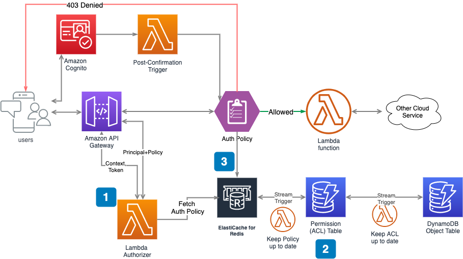

# securing-objects-in-serverless-application-object-based-authorization-in-cognito

## Code Demostration for AWS Blog
This repository is going to demostrate coding part of [Securing objects in serverless application (Object-based authorization in Cognito)](aws url later..)


There are three main parts of lambda function described in the blog:

1. Lambda function will be triggered pre API request to control the accept or deny
1. Build a policy and ACL object for lambda function to determine if current user has access to requested object. You can refer to [Post Confirmation Trigger](#post-confirmation-trigger) and [Update Acl](#update-acl) for building and managing ACL.
1. Cache the policy object to accelerate the authorization process in large scale application. You can refer to 


## Requirements
- [Python 3.8](https://www.python.org/downloads/)
- The Bash shell. For Linux and macOS, this is included by default. In Windows 10, you can install the [Windows Subsystem for Linux](https://docs.microsoft.com/en-us/windows/wsl/install-win10) to get a Windows-integrated version of Ubuntu and Bash.
- [The AWS CLI](https://docs.aws.amazon.com/cli/latest/userguide/cli-chap-install.html) v1.17 or newer.

## Setup

### Install environment using pipenv

```
pipenv install
pipenv shell
```

### Build Lambda Dependency Layer at local
To build a Lambda layer that contains the function's runtime dependencies, run `build-layer.sh`. Packaging dependencies in a layer reduces the size of the deployment package that you upload when you modify your code. You can actually find out why we use lambda layer on [youtube vlog](https://www.youtube.com/watch?v=W8aYHTVsNZQ)

```bash
./build-layer.sh
```

### Run Redis container at local to simulate ElasticCache Redis server
```bash
 docker pull redis
 docker run -p 6379:6379 --name some-redis redis

```

- A handy commandline to check the cache status

```bash
docker exec -it some-redis /bin/bash

redis-cli keys '*'
```

- Check the values of specified key in the Redis server
`redis-cli MGET 'abcd-1234-0000'`

## SAM Local Test

### Post Confirmation Trigger

Insert an item in dynamodb permission table to describe user’s permission as simple as following: sample upon user registration on Cognito.

`sam local invoke "AddUserToAcl" -e lambda/test/events/postConfirmationEvent.json`

### Update Acl

When paystubs table has been changed, the DynamoDB Streams will invoke UpdateAcl function and the auth-table will be updated.

`sam local invoke "UpdateAcl" -e lambda/test/events/ddbStream.json`

### Lambda Authorizer

Since we have built ACL for user’s permission on each object. It’s time to
generate an authorization policy(auth policy) document for the lambda
authorizer to evaluate if it should allow or deny the user API request.

`python lambda/authorizer.test.py`

We implement the Elastic Cache strategy for future scaling in the lambda authorizer

``` python
    r = redis.Redis(host=REDIS_HOST, port=REDIS_PORT, db=0)
    if r.exists(principalId):
        return r.get(principalId)
```

### About ASCENDING
ASCENDING is an AWS Certified Consulting Partner. ASCENDING provides Cloud Strategic Consulting service, Cloud Migration, Cloud Operation and web/application development services to our organization clients. ASCENDING also provides IT training (on-site bootcamp and online Udemy class) to individual customers. 
* Our recent client success [stories](https://ascendingdc.com/clientssuccesses)
* Our training [contents](https://ascendingdc.com/services/training)
* AWS Select Partner [capabilities](https://aws.amazon.com/partners/find/partnerdetails/?n=ASCENDING%20LLC&id=0010L00001v2JNtQAM)
* ASCENDING [Youtube Vlog](https://www.youtube.com/channel/UCi5_sn38igXkk-4hsR0JGtw/)

